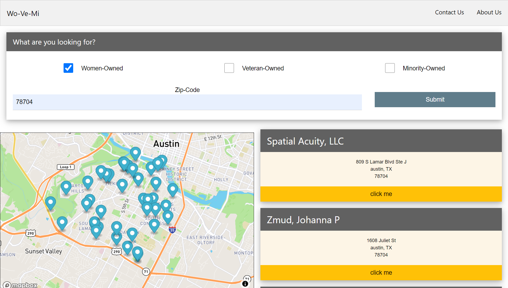

# Wo-Ve-Mi

   

## Description

A search engine highlighting Women, Veteran and Minority-Owned businesses

## Table of Contents:
* [installation](#installation)
* [usage](#usage)
* [screenshot](#screenshot)
* [credits](#credits)

## Installation 

N/A

## Usage 

 

## Screenshot

      

## Credits

Garrett Cox, Jennifer Fadare, Lafon Clark, Obinna Ezekwe and Christian Krantz

## License 

Unlicense
